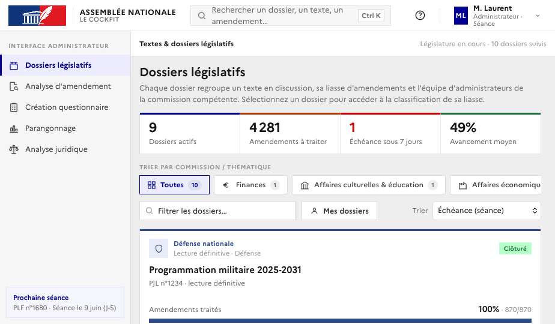
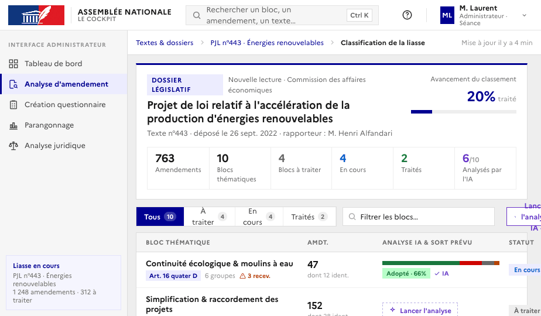
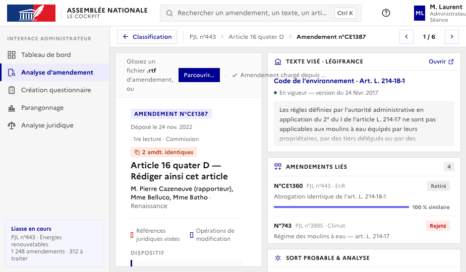
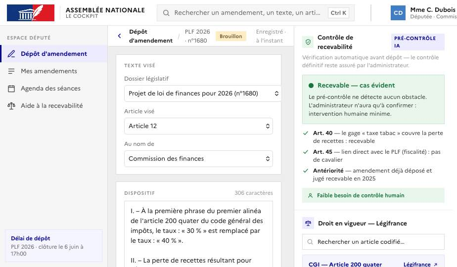

# Template DEFI.md

Remplissez les sections ci-dessous puis publiez le fichier `hackathon-an-2026/DEFI.md` dans votre dépôt.

### Nom du défi
Le Cockpit de l'instruction des amendements

### Description courte
Le poste de pilotage qui aide les administrateurs de l'Assemblée à instruire la recevabilité des amendements (art. 40, 41, 38, 45) plus vite, sans jamais leur retirer la décision. Côté député, un pré-contrôle signale le risque d'irrecevabilité dès l'écriture, avant le dépôt.

### Porteur
Matthieu Essaïdi & Vivien Sayve

### Description longue
**Le problème.** En une seule année parlementaire, **54 603 amendements** ont été déposés à l'Assemblée nationale. Chacun doit être déclaré recevable ou non (articles 40, 41, 38 et 45, lois organiques) avant tout examen, **100 % instruits avant la moindre mise en discussion**, souvent en **moins de 72 heures**. Le nombre d'amendements augmente sans cesse ; les délais, fixés par le droit, ne bougent pas. Demain, l'IA générative permettra à chaque député de produire des amendements presque sans limite : face à cette déferlante, l'administrateur ne tiendra que s'il est armé d'outils à la même hauteur. Ce contrôle repose aujourd'hui sur les seuls administrateurs, experts de la procédure, qui le mènent à la main.

**La solution.** Le Cockpit est un poste de pilotage unique qui augmente l'expertise de l'administrateur sans jamais s'y substituer :
- **Piloter le flux** : amendements triés par urgence et par échéance, doublons et amendements similaires signalés d'emblée.
- **Instruire chaque amendement** : pré-analyse de recevabilité (art. 40, 45…), mots-clés à risque surlignés, confrontation immédiate au texte de loi en vigueur (diff avant/après, navigable).
- **Préparer l'avis** : précédents et amendements similaires en un clic (recherche vectorielle), et un sort proposé (recevable / irrecevable, motif, texte justificatif).

**Le principe : l'outil préconise, l'administrateur décide.** Aucune décision automatique ; des préconisations sourcées et vérifiables ; la main reste à l'expert. Comme l'administrateur éclaire la décision du président, le Cockpit éclaire le travail de l'administrateur.

**Côté député (en développement).** Savoir, avant de déposer, si l'amendement passe : un pré-contrôle de recevabilité dès l'écriture, qui signale le risque d'irrecevabilité et pourquoi. Le contrôle définitif reste à l'administrateur.

**Ce que ça change :** le temps rendu à l'expertise, pas aux tâches répétitives.

**Souveraineté.** Bâti sur les données ouvertes de l'Assemblée nationale et de Légifrance, avec une IA agnostique tournant sur des modèles externes ou entièrement self-hosted : confidentialité et indépendance technologique préservées.

Stack : Next.js, NestJS, Prisma, PostgreSQL + pgvector, Redis, DSFR ; données ouvertes AN + dumps DILA Légifrance (LEGI/JORF) ; LLM agnostique (OpenRouter ou self-hosted llama.cpp).

### Image principale

### Contributeurs
- Matthieu Essaïdi
- Vivien Sayve

### Ressources utilisées
Cochez les ressources utilisées en remplaçant `[ ]` par `[x]`.

- [ ] `openfisca-france-parameters` - Base de données de paramètres ✺ OpenFisca
- [x] `an-dossiers-legislatifs` - Dossiers législatifs de l'Assemblée nationale (législature courante) ✺ Assemblée nationale
- [x] `an-amendements-xvii` - Amendements déposés à l'Assemblée nationale (législature actuelle) ✺ Assemblée nationale
- [ ] `an-comptes-rendus` - Comptes rendus de la séance publique à l'Assemblée nationale (législature actuelle) ✺ Assemblée nationale
- [ ] `an-votes-xvii` - Votes des députés (législature actuelle) ✺ Assemblée nationale
- [ ] `an-deputes-en-exercice` - Députés en exercice ✺ Assemblée nationale
- [ ] `an-deputes-historique` - Historique des députés ✺ Assemblée nationale
- [ ] `an-deputes-senateurs-ministres-par-legislature` - Députés, sénateurs et ministres d'une législature ✺ Assemblée nationale
- [ ] `an-agenda-reunions` - Agenda des réunions à l'Assemblée nationale (législature courante) ✺ Assemblée nationale
- [ ] `an-questions-gouvernement` - Questions de l'Assemblée nationale au Gouvernement ✺ Assemblée nationale
- [ ] `an-questions-gouvernement-ecrites` - Questions écrites de l'Assemblée nationale au Gouvernement ✺ Assemblée nationale
- [ ] `an-questions-gouvernement-orales` - Questions orales de l'Assemblée nationale au Gouvernement ✺ Assemblée nationale
- [x] `premier-ministre-legi` - Codes, lois et règlements consolidés ✺ Premier ministre
- [x] `premier-ministre-dole` - Dossiers législatifs Légifrance ✺ Premier ministre
- [x] `premier-ministre-jorf` - Édition ''Lois et décrets'' du Journal officiel ✺ Premier ministre
- [ ] `senat-dispositifs-textes` - Dispositifs des textes déposés ou adoptés au Sénat ✺ Sénat
- [ ] `senat-dossiers-legislatifs` - Dossiers législatifs du Sénat ✺ Sénat
- [ ] `senat-amendements` - Amendements déposés au Sénat ✺ Sénat
- [ ] `senat-senateurs` - Sénateurs ✺ Sénat
- [ ] `senat-questions-gouvernement` - Questions orales et écrites du Sénat au Gouvernement ✺ Sénat
- [ ] `senat-comptes-rendus` - Comptes rendus de la séance publique au Sénat ✺ Sénat
- [ ] `an-et-co-database-regroupement-toutes-donnees` - Base de données unifiée Parlement / Législation / Service Public ✺ Assemblée nationale & communauté
- [ ] `an-et-co-serveur-mcp-regroupement-toutes-donnees` - Serveur MCP  - Accès unifié Parlement / Législation / Service Public ✺ Assemblée nationale & communauté
- [ ] `an-et-co-api-regroupement-toutes-donnees` - API - Accès unifié Parlement / Législation / Service Public ✺ Assemblée nationale & communauté
- [ ] `legiwatch-api-parlement` - API Parlement ✺ LegiWatch
- [ ] `legiwatch-database-parlement` - Base de données Parlement ✺ LegiWatch
- [ ] `legiwatch-serveur-mcp-parlement` - Serveur MCP Parlement ✺ LegiWatch

### Galerie

### Documents
[Présentation « Le Cockpit » (PDF)](docs/presentation-le-cockpit.pdf)

### URL de démonstration
https://emendare.fr

### Diapositives de présentation
[Présentation « Le Cockpit » (PDF, sommaire cliquable)](docs/presentation-le-cockpit.pdf)
